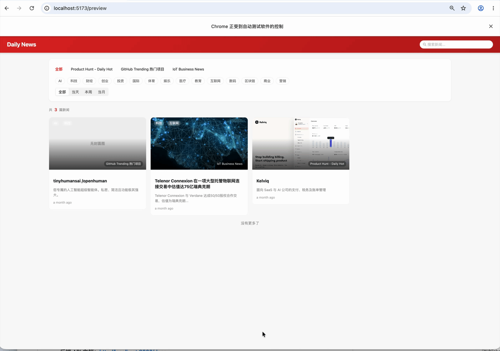

# Daily News Pro

一款功能完整的新闻抓取与聚合工具，支持自定义爬取规则、定时任务、AI 分析、翻译及多渠道推送。

## 演示



## 技术栈

| 层级 | 技术 |
|------|------|
| 后端 | FastAPI · SQLAlchemy · SQLite · APScheduler · Playwright |
| 前端 | React 18 · TypeScript · Vite · Ant Design 5 |
| 内容提取 | Trafilatura · BeautifulSoup4 · lxml · 自定义 CSS/XPath/Regex 选择器 · RSS/Atom |
| AI / LLM | OpenAI 兼容接口 · Anthropic Claude · Google Gemini |
| 推送集成 | 飞书 Webhook · 钉钉 Webhook · HTTP 自定义推送 |

## 功能特性

- **抓取规则管理**：可视化配置抓取目标 URL、提取字段、请求头等参数；支持静态 HTTP 与 Playwright 动态渲染两种抓取模式
- **多策略提取**：支持 CSS 选择器、XPath、Regex、JSON Path、RSS/Atom 等多种提取策略
- **渠道管理**：统一管理多个新闻源渠道，支持分组与标签
- **定时任务**：基于 APScheduler 的定时爬取任务，支持 Cron 表达式
- **文章管理**：文章列表、全文展示、标签分类、Markdown 编辑与渲染
- **AI 分析与翻译**：支持 OpenAI 兼容接口、Anthropic Claude、Google Gemini 等多种大模型；支持 9 种语言的自动翻译（中/英/日/韩/法/德/西/俄/阿）；支持基于标签池的智能标签生成
- **内容推送**：支持飞书、钉钉 Webhook 及自定义 HTTP 推送，支持 Jinja2 消息模板
- **批量操作**：支持批量翻译、批量抓取、批量删除
- **预览调试**：实时预览抓取结果，内置页面结构分析与选择器自动识别工具
- **公开预览页**：面向读者的公开文章列表页
- **Admin 鉴权**：基于 HMAC-SHA256 Token 的管理员认证，全 API 保护

## 目录结构

```
daily-news-pro/
├── backend/                # FastAPI 后端
│   ├── app/
│   │   ├── main.py         # 应用入口
│   │   ├── config.py       # 配置管理
│   │   ├── database.py     # 数据库初始化
│   │   ├── models/         # SQLAlchemy 数据模型
│   │   ├── schemas/        # Pydantic 请求/响应模型
│   │   ├── routers/        # API 路由（articles, rules, jobs, channels 等）
│   │   ├── services/       # 业务逻辑（crawler, scheduler, analyzer 等）
│   │   ├── middleware/     # 鉴权中间件
│   │   └── utils/          # 工具函数
│   ├── data/
│   │   ├── database.db     # SQLite 数据库
│   │   └── articles/       # 文章 Markdown 存储
│   ├── requirements.txt
│   └── .env.example
└── frontend/               # React 前端
    ├── src/
    │   ├── pages/          # 页面组件（Dashboard, Articles, Rules 等）
    │   ├── components/     # 公共组件
    │   ├── api/            # Axios 请求封装
    │   └── types/          # TypeScript 类型定义
    ├── package.json
    └── vite.config.ts
```

## 快速开始

### 环境要求

- Python 3.10+
- Node.js 18+

### 后端启动

```bash
cd backend

# 创建并激活虚拟环境
python -m venv venv
source venv/bin/activate  # Windows: venv\Scripts\activate

# 安装依赖
pip install -r requirements.txt

# 安装 Playwright 浏览器（用于 JS 渲染页面抓取）
playwright install chromium

# 复制并编辑环境变量
cp .env.example .env
# 修改 .env 中的 ADMIN_PASSWORD 和 SECRET_KEY

# 启动服务
uvicorn app.main:app --reload --host 0.0.0.0 --port 8000
```

### 前端启动

```bash
cd frontend

# 安装依赖
npm install

# 启动开发服务器
npm run dev
```

启动后访问：
- 前端：http://localhost:5173
- 后端 API 文档：http://localhost:8000/docs

### 生产部署

#### 前端构建

```bash
cd frontend
npm run build
# 构建产物位于 frontend/dist/
```

#### 后端生产运行

```bash
cd backend
# 使用 gunicorn + uvicorn workers
pip install gunicorn
gunicorn app.main:app -w 4 -k uvicorn.workers.UvicornWorker --bind 0.0.0.0:8000
```

#### Nginx 反向代理（可选）

将前端静态文件和后端 API 统一通过 Nginx 代理：

```nginx
server {
    listen 80;
    server_name your-domain.com;

    # 前端静态文件
    root /path/to/frontend/dist;
    index index.html;
    location / {
        try_files $uri /index.html;
    }

    # 后端 API 反向代理
    location /api {
        proxy_pass http://127.0.0.1:8000;
        proxy_set_header Host $host;
        proxy_set_header X-Real-IP $remote_addr;
    }
}
```

## 环境变量说明

复制 `backend/.env.example` 为 `backend/.env` 并按需修改：

| 变量 | 说明 | 默认值 |
|------|------|--------|
| `HOST` | 服务监听地址 | `0.0.0.0` |
| `PORT` | 服务端口 | `8000` |
| `DATABASE_URL` | 数据库连接地址 | `sqlite:///./data/database.db` |
| `FRONTEND_URL` | 前端地址（CORS 白名单） | `http://localhost:5173` |
| `ADMIN_PASSWORD` | 管理员登录密码 | **必须修改** |
| `SECRET_KEY` | JWT 签名密钥 | **必须修改** |
| `DEFAULT_USER_AGENT` | 默认 User-Agent | `Mozilla/5.0 … Chrome/… Safari/…` |
| `DEFAULT_DELAY_MIN` | 爬取请求最小延迟（秒） | `1` |
| `DEFAULT_DELAY_MAX` | 爬取请求最大延迟（秒） | `3` |

> 生产环境请务必将 `ADMIN_PASSWORD` 和 `SECRET_KEY` 替换为强随机值。
> 生成随机 SECRET_KEY：`openssl rand -hex 32`

## 故障排查

### Playwright 浏览器安装失败

macOS/Linux 系统可能需要额外安装系统依赖：

```bash
# 安装 Chromium 浏览器
playwright install chromium

# 安装系统级依赖（如缺少 libnss3 等）
playwright install-deps chromium
```

如果仍然失败，可手动查找依赖：
```bash
ldd ~/.cache/ms-playwright/*/chrome-linux/chrome 2>&1 | grep "not found"
```

## API 文档

后端基于 FastAPI 自动生成 OpenAPI 文档，启动后访问：

- Swagger UI：http://localhost:8000/docs

## License

[MIT](./LICENSE) © 2025 Anthonybuer182
